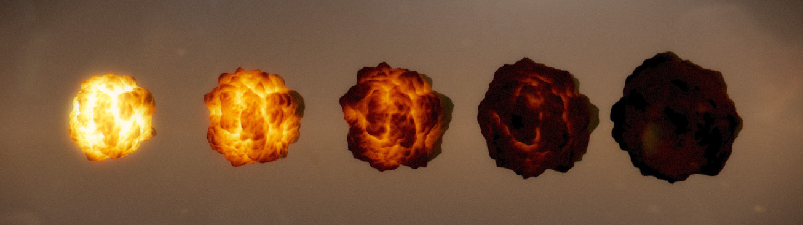

Fire Simulation
===


*This is my original project for propose to 2110594 Computer Graphics and Physics Simulation class
in Chulalongkorn University.*

Fire simulation base on WebGL using THREE.JS library. Using volumetric fire technique for this implementation. Fully customizing on fire color and particle system in real-time.
The simulator are run smoothly with 60 fps frame rate,
optmized by object pooling method.

## Demo

:point_right: Available demo :  [https://neungkl.github.io/fire-simulation/](https://neungkl.github.io/fire-simulation/)

## Report

:page_facing_up: You can read full PDF report in [fire-simulation_report.pdf](fire-simulation_report.pdf)


## Works

- I starting with building a volumetric fire called flame ball, with customize vertex shader and fragment shader,
the result look similar to below figure.



- The flame ball part I using [Perlin Noise](https://en.wikipedia.org/wiki/Perlin_noise) algorithm for making the
randomize texture of flame ball and apply the color depends on the deep
of surface.
- Combine each flame ball to a large fire using [Interpolation](https://en.wikipedia.org/wiki/Interpolation) for animation
each frame of flame ball.
- Add particle system for spark system.
- Fully customization for fire color and spark color.
- Renderer time scale included.
- Optimized by using object pooling approach.

## Usage

### Run the simulator

1. Enter following command.
```sh
$ npm install -g typescript grunt
$ npm install
```
2. Run build script
```
$ grunt
```
3. Change code in `index.html`

  ```html
  <!-- Change this -->
  <script src="dist_github/app.js"></script>

  <!-- To this -->
  <script src="dist/app.js"></script>
  ```
4. Open file `index.html`

### Developement

```
$ grunt watch
```

## Thanks

- Palin Noise https://en.wikipedia.org/wiki/Perlin_noise
- Vertex Displacement with a noise function using GLSL and three.js https:// www.clicktorelease.com/blog/vertex-displacement-noise-3d-webgl-glsl-three-js
- Easing Equation by Robert Penner http://gizma.com/easing/
- Object Pool Pattern https://en.wikipedia.org/wiki/Object_pool_pattern

## License

[MIT](LICENSE) © Kosate Limpongsa
