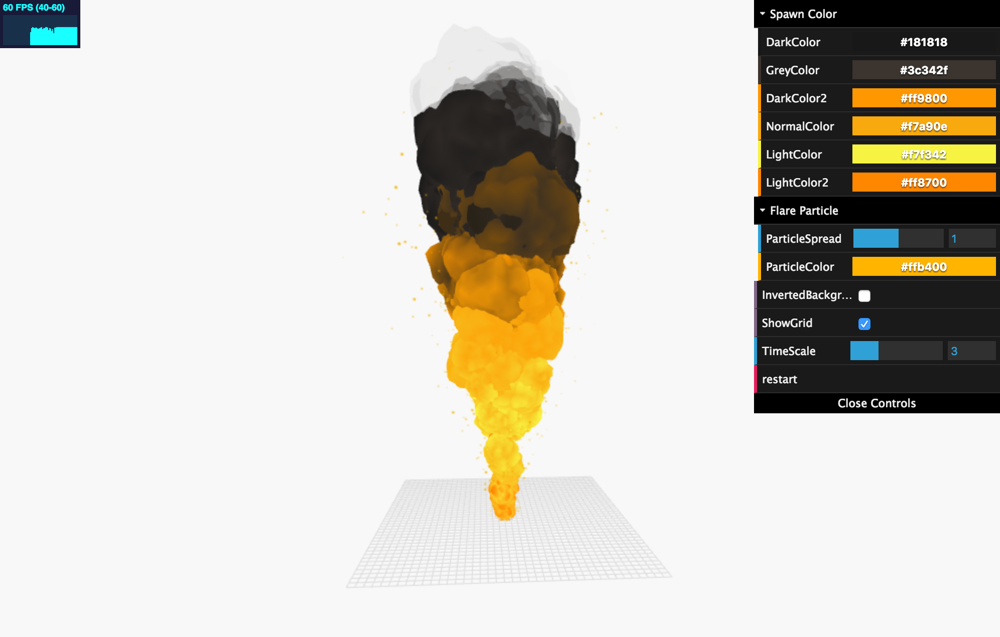

Fire Simulation
===



*This is my original project for purpose to 2110594 Computer Graphics and Physics Simulation class
in Chulalongkorn University.*

Fire simulation base on WebGL using THREE.JS library. Using volumetric fire technique for this implementation. Fully customizing on fire color and particle system in real-time.
The simulator are run smoothly with 60 fps frame rate,
optmized by object pooling method.

*In Development*

## Demo

:point_right: Available demo :  [https://neungkl.github.io/fire-simulation/](https://neungkl.github.io/fire-simulation/)


## Usage

```
npm install -g typescript
npm install
```
